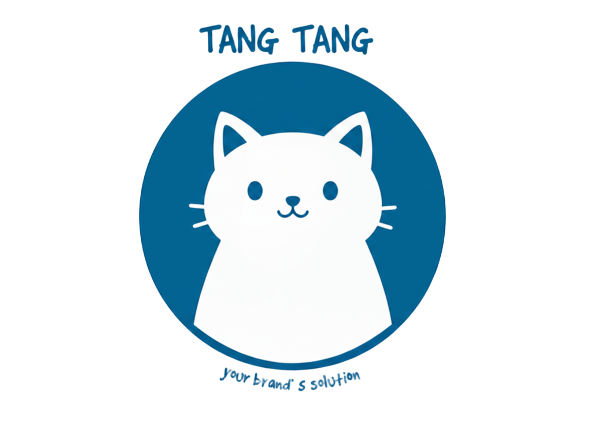

<p align="center">
  
</p>

# TangTangTodo - Premium Productivity Portal

TangTangTodo adalah aplikasi manajemen tugas dan diskusi komunitas yang dibangun dengan Next.js, Tailwind CSS, dan Firebase. Aplikasi ini dirancang untuk memberikan pengalaman produktivitas yang elegan dengan fitur sosial yang terintegrasi.

## Fitur Utama

- Dashboard Produktivitas: Visualisasi aktivitas harian dengan grafik interaktif.
- Jurnal Pintar: Simpan refleksi harian dengan mood tracker dan simulasi media.
- Diskusi Komunitas: Berbagi tips, kasih Like, Balas postingan, dan buat Polling secara real-time.
- Profil Personalisasi: Kustomisasi profil dengan modal premium dan histori postingan pribadi.
- Analisis Lanjutan: Toggle tampilan Mingguan/Bulanan untuk melacak progres jangka panjang.
- Firebase Sync: Data tersimpan aman dan tersinkronisasi antar perangkat.

## Tech Stack

- Framework: Next.js 15+ (App Router)
- Styling: Tailwind CSS
- Database & Auth: Firebase (Firestore & Authentication)
- Icons: Google Material Icons

## Memulai

### 1. Clone Repositori

```bash
git clone https://github.com/zhaalys/TangTangTodo.git
cd TangTangTodo
```

### 2. Install Dependensi

```bash
npm install
```

### 3. Jalankan Development Server

```bash
npm run dev
```

Buka http://localhost:3000 untuk melihat hasilnya.

## Konfigurasi Firestore

Pastikan akun Firebase kamu sudah memiliki Composite Index berikut untuk halaman profil:

- Collection: posts
- Fields: userId (Ascending) & createdAt (Descending)

---

Dibuat untuk produktivitas yang lebih baik.
